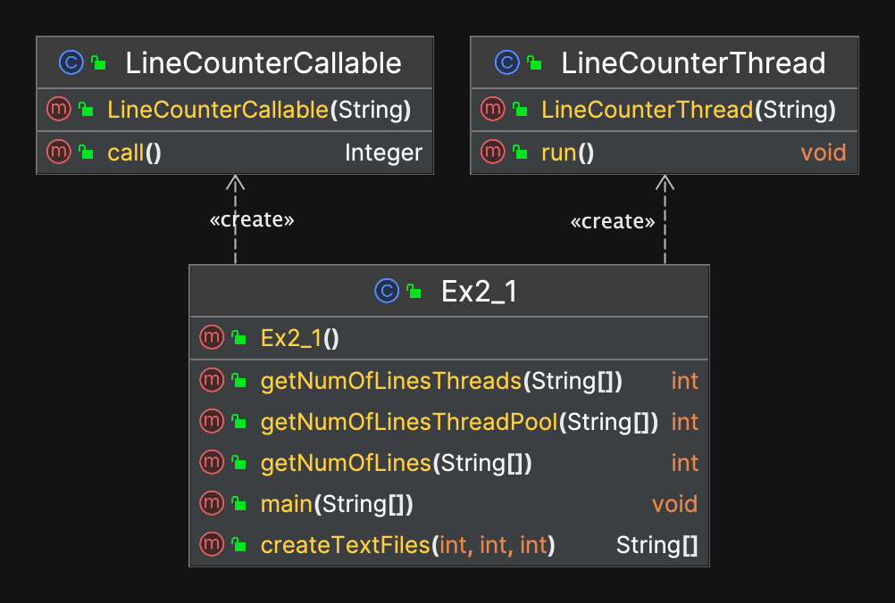
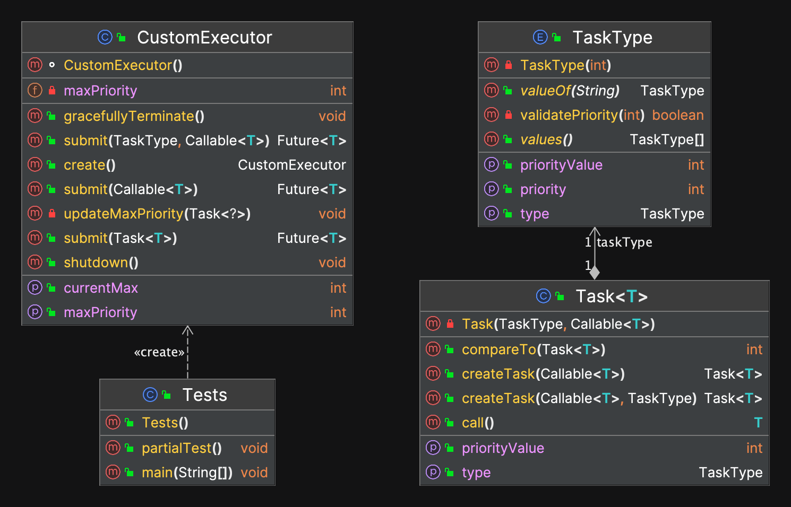

# Ex2

<h1> EX2_1 <h1>
  
<h3> explanation about what we did in this part :   

making a number of text files and sum the number of lines in these files.

We're going to do this 3 times in 3 different methods.
- without threads
- using threads
- using Threadpool
  
  
   <h2> explaining the part 5 in the first part of the assignment
   which is about threads and why it might be faster or slower 
   based on the mission it has to complete <h2> 
   
  
   <h5> first lets talk about why threadpool is faster and more efficient than Multithreading :
   A thread pool is a design pattern in software engineering, where a collection of threads wait for tasks to be assigned to them.
   The traditional way of thread utilization is to create a new thread for each task and then destroy that thread once the task is finished. However, this 
   approach is not scalable, because when your program starts having several tasks, the overhead of creating and destroying threads slows down your program  
   considerably.

  By using thread pools, multiple long-lasting threads are initialized to begin with, and they wait to be assigned tasks. After these threads complete 
  their tasks, they are not destroyed, but they can actually be reused to complete more tasks. This is a far more efficient use of threads, as threads can
  be used over and over again instead of wasting time destroying and creating new threads to perform another incoming task.
  
  
  now lets talk about why threading might be a problem in some tasks and not using it might be way more efficient that using it : 
  
  one way of this might happen is when we wanna read from a small sized file so reading it directly is way faster that creating thread and reading it
  
  another one is the time that thread interchange will be big and doing the task directly like reading files more faster
  
  and another example might be is when threads wait for eachother may take a long time and be less efficient 
  
  and the last example i may think of for now is when we make alot of threads that handicap the cpu and make his job harder interchange between all the thread <h5>
  
  <h2> now lets see our program and decide which is faster <h2>
    
  the program we have written is reading from alot of files by regular method without using thread
  and one with using thread 
  and one with using thread pool
  
 
    
  
 ----------------------------------------------------
 
    
    
   
  
 

    
    
  <h2> now our conclusion <h2>
    
    as we see here is 4 examples that proof our explanation that 
    sometimes using threads may be more demanding to our cpu
    and we can see also that using threadpool is far more superior 
    and efficient that using Multithreading 

and before we end the part one and move on the part 2 
of the assignment we wanna add the UML diagram 

<h1> Ex2_2 <h1>
  
  
<h3>
in this part we want to solve this problem : 

  In java, we cannot give a priority to an asynchronous task,
  java give the programmer the option to give a priority to thread,
  but not to the task in the thread. That's why we need to make an object which    
  represent asynchronous task with a priority and also a kind of ThreadPool which support in tasks with priority.  
  
  <h3>
<h3>
The proposed design for the Task and CustomExecutor classes contributes to the 
flexibility, performance, and maintainability of the code in the following ways:
<h3>

- Flexibility: 
      
      
      The Task class allows users to create tasks that may return a value of any type,
      and may throw an exception if unable to compute the result.
      This allows users to create a wide variety of tasks with different functionality.

      
      The CustomExecutor class allows users to submit tasks to be executed asynchronously,
      either as a Task object, or as an operation that may return a value and optionally a TaskType.
      This allows users to submit tasks in a way that is most convenient for their use case.
      
      
      
- Performance:

      
      The CustomExecutor class uses a ThreadPoolExecutor to execute tasks asynchronously,
      which can improve the performance of the application by allowing tasks to be executed concurrently.
      
      
      The CustomExecutor class uses a PriorityBlockingQueue to store the tasks,
      which allows tasks to be ordered according to their priority.
      This can improve the performance of the application by allowing tasks with higher priority to be executed before tasks with lower priority.
      

- Maintainability:

      
      The Task class is designed to be used with the CustomExecutor class,
      which makes it easier to understand how the two classes work together and how they should be used.
      
      
      The CustomExecutor class is designed to be easy to use and understand,
      with clear method names and well-defined behavior. This makes it easier to maintain and modify the code in the future.
      
      The CustomExecutor class is designed to be thread-safe,
      which makes it easier to use in a multithreaded environment without causing race conditions or other synchronization issues.
      This helps to improve the maintainability of the code,
      as it reduces the risk of introducing bugs due to concurrency issues.
      
      
      
<h1> UML Ex2_2 <h1>
  
  
  
